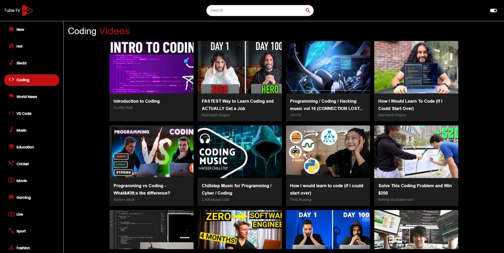

# Tube-Fx | YouTube clone using rapid api | A react app.

Tech & Tools used:

- React js
- React-router-dom
- React-player
- Material Ui
- Rapid Api

## Features of Tube Fx

- Real time video feed
- Channel details
- Video player
- Search any video/ channel
- Responsive design
- Different dynamic catagories
- Theme change (Dark/Light)
- Total theming change including primary color also possible.

## Multi Paged Web App

This app contains pages like:

- Feed page
- Channel page
- Video details page
  Various information related to video are showcased manually.

# [`tube-fx` Website Hosted on Netlify](https://tube-fx.netlify.app)

[](https://app.netlify.com/sites/tube-fx/deploys)

## Snapshot



## Environment Variables

To run this project, you will need to add the following environment variables to your .env file

`REACT_APP_RAPIDAPI_KEY`

`REACT_APP_RAPIDAPI_HOST`

## Run Locally

Clone the project

```bash
  git clone https://github.com/shz-code/tube-fx.git
```

Go to the project directory

```bash
  cd tube-fx
```

Install dependencies

```bash
  npm install
```

Start the server

```bash
  npm start
```

## Acknowledgements

- Rapid Api ([Youtube V3](https://rapidapi.com/ytdlfree/api/youtube-v31/)) Api
- Project Idea from [adrianhajdin](https://github.com/adrianhajdin)
